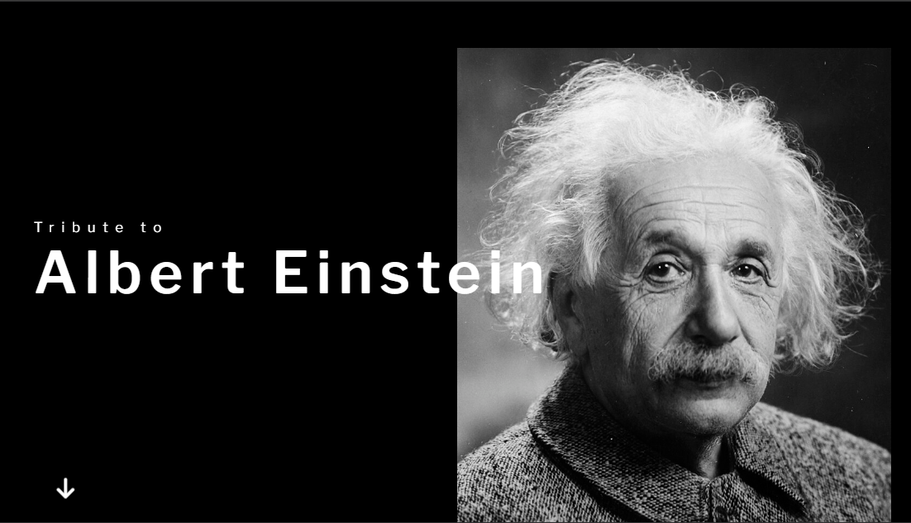

<h2 align="center">
  Tribute Page - 
  <a href="https://tribute-page-mridul.vercel.app/" target="_blank">Albert Einstein</a>  
  
Welcome to Albert Einstein's Tribute Page!

</h2>

  

## Introduction

Welcome to the tribute page dedicated to Albert Einstein, one of the most influential physicists of the 20th century!

## Table of Contents

- [Introduction](#introduction)
- [Technologies Used](#technologies-used)
- [Features](#features)
- [License](#license)
- [Contact](#contact)
- [Show Your Support](#show-your-support)

## Introduction

This project is a tribute page to Albert Einstein, showcasing his life, contributions, and legacy.

## Technologies Used

This tribute page was built using the following technologies:

- HTML
- CSS
- JavaScript

## Features

- Responsive design
- Informative content about Albert Einstein's life and achievements
- Easy navigation with table of contents

## License

This project is licensed under the [MIT License](LICENSE).

## Contact

Feel free to reach out to the creator at [mridulmkumar07@gmail.com](mailto:mridulmkumar07@gmail.com) or visit their website [mridul.app](https://mridul0703.vercel.app/) for more information.

## Show Your Support

Give a ⭐ if you appreciate Albert Einstein's contributions to science!
